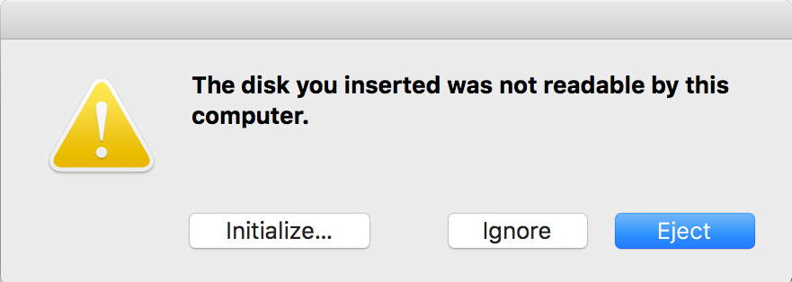

# Arch Linux - Installation and Setup
Personal How-To Guide to install and setup Arch Linux.

There are several YouTube videos where this process is explained, but I have decided to create my own installation guide so it is always available and I can tweak it a little bit if I found something can be done easier or faster.

<br>

> _It is always recommended to play around a little bit the the Arch Linux installation on a **Virtual Machine** until you get used to the process and get more familiar with the commands it will require_ ;)

<br>

## Table of Contents


<br>

## Materials

To be able to complete the installation, there are some things to gather first

* Get a USB Flash Drive (I'm using one with 16GB of space)
* Get the **Arch Linux ISO**
* A computer in which you can _**properly format** the USB Flash Drive to be used as Bootable Device for the installation process_

<br>

### Downloading the Arch Linux ISO

You can download the Arch Linux `.iso` from [here](https://www.archlinux.org/download/). 

There are several options to download the file (from Torrents to mirrors all around the globe)

<br>

### Creating the Bootable Device

#### Mac OS

For this guide, I'm using a Mac with Mac OS Mojave (10.14.10) but I'll try to list the required steps to do the same either if you're using Windows or Linux.

* First of all, insert the USB you're going to use to boot Arch Linux **(don't forget to check if you have any valuable data on the USB Flash Drive because after what we're going to do, everything in there will fly, fly away to nowhere)**
* Run the following command to get a list of all the mounted disk on your Mac:
  ```bash
  $ diskutil list
  ```

* You should get an output similar to the following _(you might get different results depending on how many drivers are mounted on your Mac)_. In this case, I only have one external USB currently plugged in:
  ```bash
  /dev/disk2 (external, physical):
  #:                       TYPE NAME                    SIZE       IDENTIFIER
  0:     FDisk_partition_scheme                        *15.6 GB    disk2
  1:             Windows_FAT_32 NO NAME                 15.6 GB    disk2s1
  ```

* Grab the name of the Device that we're going to format (in this case `/dev/disk2`)

* In order to be able to format the Device, we need to **unmount it** first. Run the following command making sure that your replace `/dev/disk2` with your own Device identifier:
  ```bash
  $ diskutil unmountDisk /dev/disk2
  ```

* Once unmounted, you'll see an output similar to:
  ```bash
  Unmount of all volumes on disk2 was successful
  ```

* Then, run the following command to format the Device and copy the `.iso` into it:
  ```bash
  $ sudo dd if=/Users/you_user/Downloads/archlinux-2019.08.01-x86_64.iso of=/dev/rdisk2 bs=4m && sync
  ```

  Where

  * `sudo` is required to get root privileges and be able to run the actual command (it will ask for your password)

  * `dd`, which stands for **Data Duplicator**, is the program we're going to use to write the data into the Flash Drive (more information about the program can be found [here](https://ss64.com/osx/dd.html))

  * `if=` is the path of the file from where we're going to read the data to be written into the Flash Drive (in this case, the path where the `.iso` is stored on my Mac)

  * `of=` is the path of where the data is going to be written (in this case, in our previously unmounted External Flash Drive). Please, **be very, very careful when setting up the destination of the data, as you might get into serious trouble if you mistakenly set it to another drive location besides the desired External Flash Drive**

  * `bs=4m` means that we're setting both, input and output block sizes, to 4 megabytes (so the data is written in blocks of 4 megabytes, which will only increase a little bit the process)
  
  * `&& sync` is actually another command (not an option of `dd`). It will clear the cache (after running `dd` -_that's why it is used after the `&&`_) and will ensure that all the data is written into the drive and nothing is left in the cache

* Once you've checked that everything is looking good (all names/paths are correct), hit `enter` and wait for the command to finish its job (it might take some time to complete).

* After the `.iso` is completely written into the USB, you'll get an output like the following:
  ```bash
  155+1 records in
  155+1 records out
  652214272 bytes transferred in 63.194349 secs (10320769 bytes/sec)
  ```
 
* And then you'll be prompted with the following message (just click the **Ignore** button):

  


* To reverse the process, you only need to re-format the USB Flash Drive with the desired settings and it will become usable to write/read data again.

After all of the above steps are complete, we should be ready to boot up Arch Linux from the USB Flash Drive and start with the installation process.

<br>

#### Windows

<br>

#### Linux