# Installing Arch Linux on a Virtual Machine (UEFI Mode)

Most of the guides and tutorials  for installing Arch Linux on a VM out there on the internet use **Legacy Mode** instead of **UEFI**, which is usually preferred when installing the OS on real hardware (not virtualized). 

> _You can find more information about both types on [this article](https://www.partitionwizard.com/partitionmagic/uefi-vs-bios.html)_

On this particular guide, we'll still install Arch Linux on a virtual machine but using **Virtual Box's EFI Mode** to simulate the real hardware (and eventually be able to reproduce the steps when doing it on a real PC).

<br>

_**A wired internet connection is preferred to follow along further steps because we're not only going to install packages from the `.iso` itself but also from the internet**_

<br>

## Download the Arch Linux ISO

As simple as going to the [Arch Linux Download page](https://www.archlinux.org/download/) and downloading the file either via torrent or any or the mirrors available worldwide.

<br>

## Creating the Virtual Machine

* Open Virtual Box (if you don't have it installed yet, please download the installer from [Virtual Box's Official Page](https://www.virtualbox.org) and install it on your computer), click the **New** button and let's create a new virtual machine:

  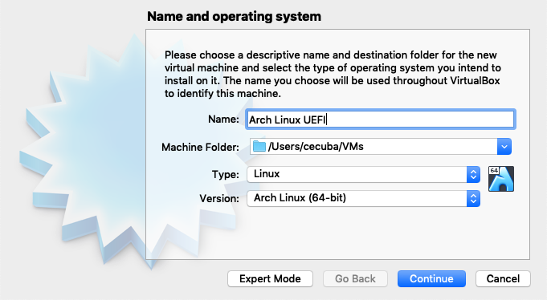

  <br>

  * Give it a **name** _(I'm naming mine `Arch Linux UEFI` because... yes, you guessed it! We'll be simulating the installation on a real device)_
  * Select the **location** where your Virtual Machine's drive will live in
  * Virtual Box is smart enough to infer that, given the name we're using for the VM, its **Type** and **Version** should be `Linux` and `Arch Linux (64-bit)` correspondingly.

* Once done, click **Continue** and let's give our VM some RAM _(1 or 2 gigs will be more than enough for this kind of installation, but if your host computer has the resources, feel free to bump it up to the number of gigs you desire)_:

  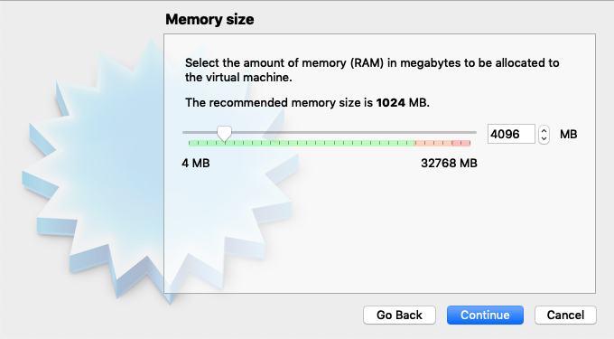

  <br>

* Click **Continue** and then select **Create a virtual hard disk now**:

  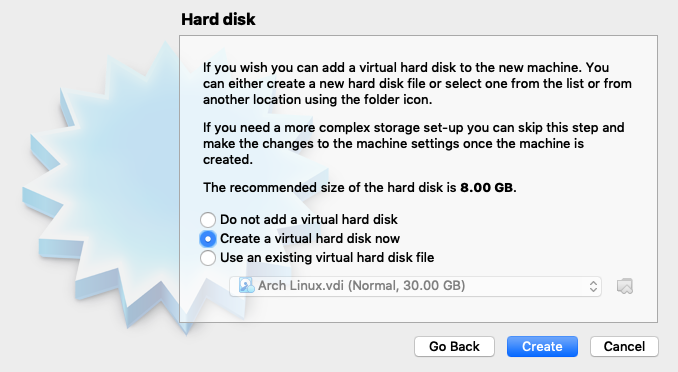
  
  <br>

* Click **Create** and choose the default **VDI** option:

  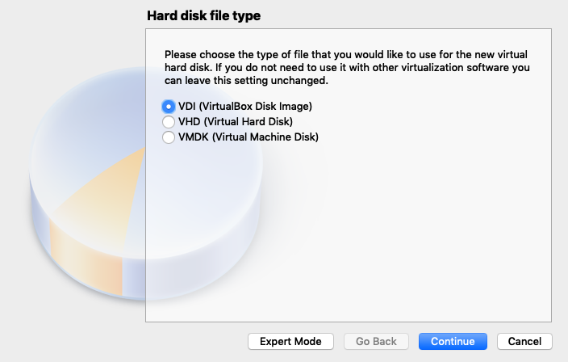

  <br>

* Click **Continue** and choose the default **Dynamically allocated** option:

  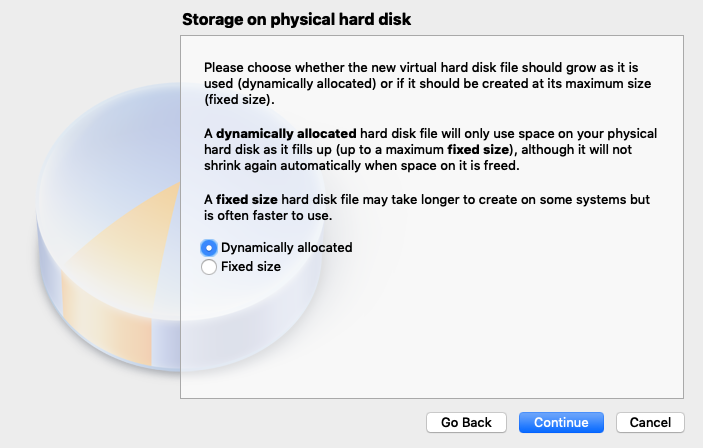

  <br>

* Click **Continue** and set the desired size of the virtual disk we're going to create for the VM _(8 gigs of space is what Virtual Box suggests for most of the Linux installations, but we might want to give it a little more extra space to be able to install some additional packages and don't get into troubles if we're running out of space in the middle of the installation)_:

  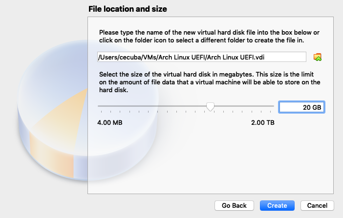

  <br>

* Click **Create** and we're almost there! Just a few additional things to tweak before getting into the real action.

* Right Click on the brand new VM and click **Settings**: 

  * Navigate to the **System** tab and 
    * On the **Motherboard** sub-tab, **make sure that you check the "Enable EFI (special OSes only)" option**, because remember: _We are simulating the installation on a real device via a VM_
    * On the **Processor** sub-tab, configure the number of processors you'll want the VM to have (in my case, I'll set it up with 2)
  * Navigate to the **Display** tab and 
    * Configure how much Video Memory you'll want the VM to have (in my case, I'll set it up with 128 MB)
    * Change the default **Graphics Controller** from **VMSVGA** to **VBoxVGA** (which will work better if later on we decide to install a Graphical Environment)
    * Check the **Enable 3D Acceleration** option
  * Navigate to the **Storage** tab and
    * Click the **Add Optical Drive** button (next to the **Controller: IDE**)
    * Click **Choose Disk**
    * Find the Arch Linux `.iso` you've just downloaded

* Once everything is setup, we're ready to start our VM!

* Double click on it, or select it and click the **Start** button and there we go... (_it might take some time to boot up, don't be scared_ 🤓)

  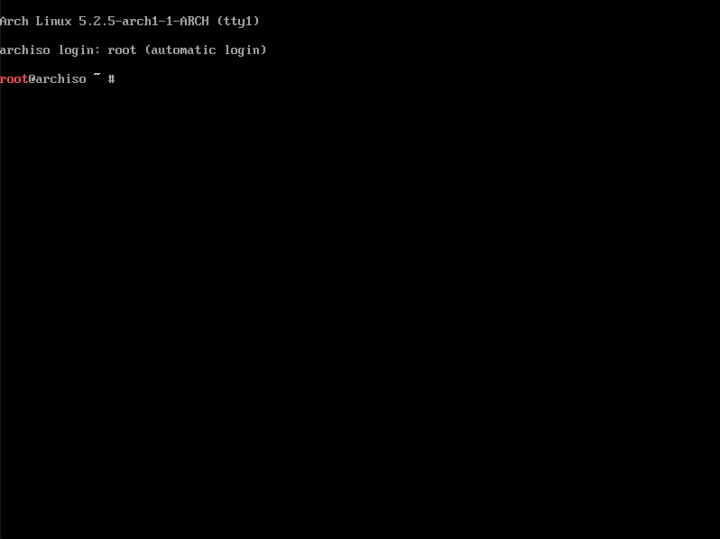

<br>

## Initial Setup

So we have boot into the Live Environment and we're automatically logged in as the **root user** because at this point there's only one user on the system. What do we do now? _We only have the prompt..._

One of our best friends from this point will be the [Arch Linux Official Installation Guide](https://wiki.archlinux.org/index.php/Installation_guide), where you'll be able to find an extensive ~~not that much, actually~~ list of resources that can help you out with some additional _fine tuning_ of your current installation. For the purposes of this guide, we'll only focus in the things that we need.

### Keyboard Layout

If you're using an English keyboard, then you don't need to change anything at all. Arch Linux comes by default with an English Keyboard Layout properly setup. On the other hand, if you have any other type of layout, please take a look at [this section](https://wiki.archlinux.org/index.php/Installation_guide#Set_the_keyboard_layout).

### Verify the boot mode

If you're using **UEFI** (as I am) for the current installation, you might want to check that the iso has been booted properly. To do so, run the following command on the prompt:
```bash
$ ls /sys/firmware/efi/efivars
```

You should be prompted with a similar output:

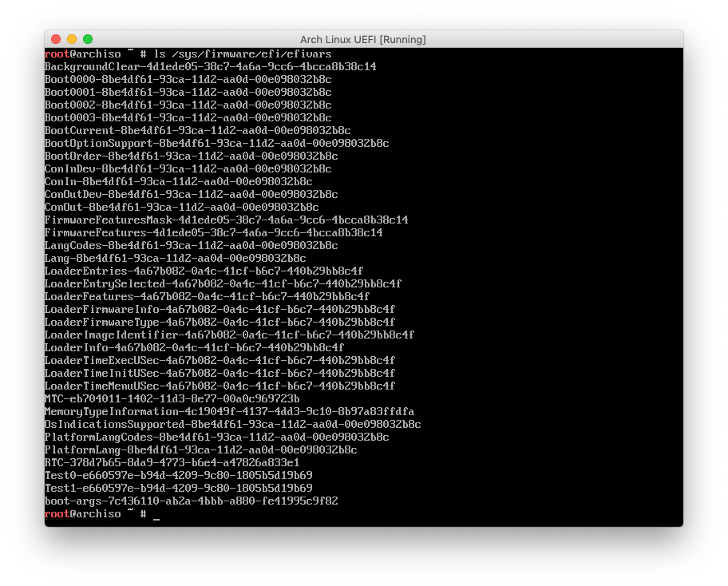

This will confirm that we are actually booting the system on **UEFI** mode.

> _If the directory does not exist, the system may be booted in **BIOS** or **Legacy Mode**, which is fine, but not for the purposes of this guide_

<br>

### Check that we have working internet connectivity

Just run the following command to make sure that we have internet connection _(again, it is recommended to have the Host Machine connected to the internet via wire because it will simplify a lot the process and we'll have more stable connectivity)_:
```bash
$ ping -c 4 archlinux.org
```

If everything is working as expected, you 'll be prompted with the successful response of the pings:

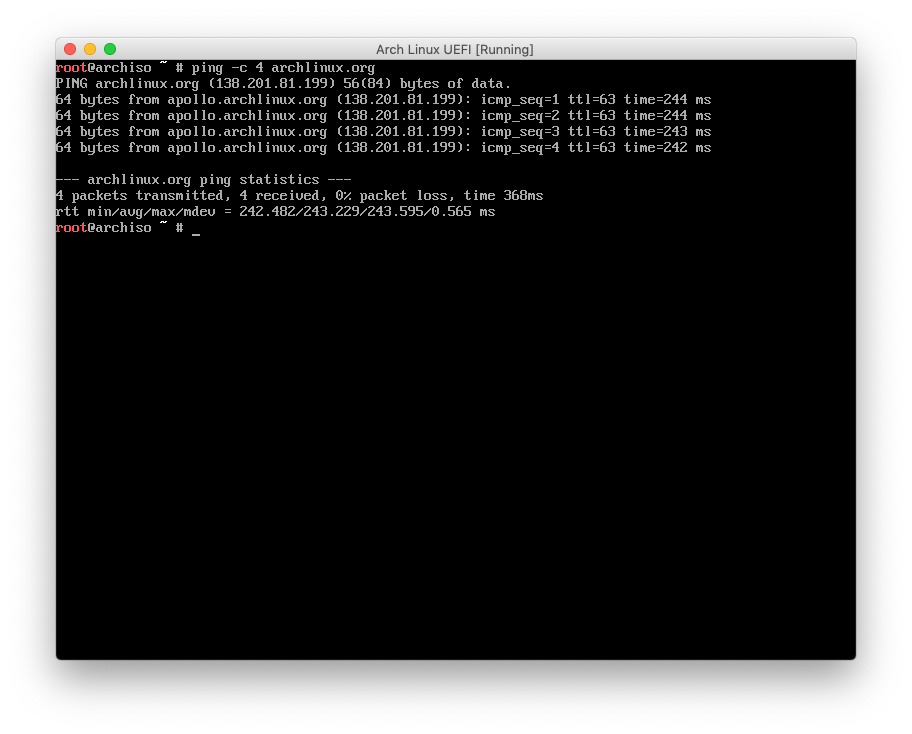

> _If you don't have access to a wired connection, you can use the `wifi-menu` command to be able to select a WiFi network and connect to it_

<br>

### Update the System Clock

We need to make sure that the System Clock on the Live Environment is set correctly, so let's run the following command:
```bash
$ timedatectl set-ntp true
```

And then run `timedatectl status` to check the service status:

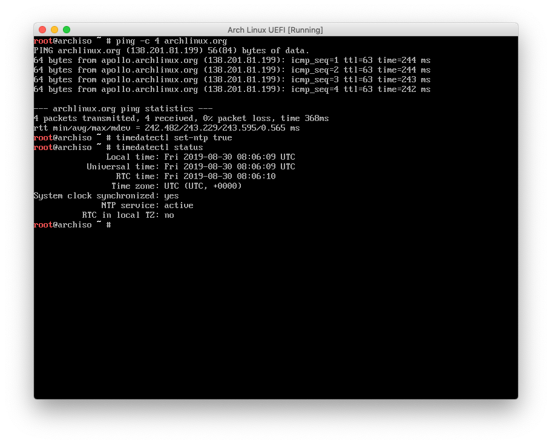

<br>

### Partition the Disk

Here's where the fun starts... 🥳

<br>

We need to make sure first that we know exactly how many disks we have currently connected into our machine _(VM, in this case)_. To do so, run the following command:
```bash
$ fdisk -l
```

And check the output:

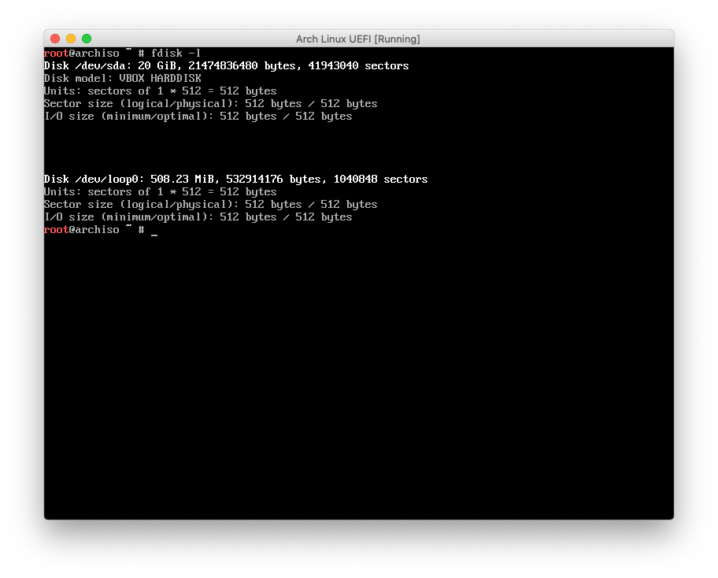

> _You can also run `lsblk` to get some more information about the physical/virtual drives that are currently connected_

<br>

You might get different results depending on how many (and what type of) hard drives you have currently connected, but in this case we can see our Main Hard Drive (the one we created for the VM) -> **`/dev/sda`** and the Arch Linux ISO (which is still mounted and in use) -> `/dev/loop0`.

> _If you have several hard drives connected, make sure to identify which is the one where you want to continue with the installation_

<br>

At this point, the disk we're going to use (brand new) does not have any partitions, so we need to create them.

We're going to use `cfdisk` (which is better/easier to use than the `fdisk` command suggested on the official installation guide) to properly partition the disk:

* Run the following command
  ```bash
  cfdisk /dev/sda
  ```
  > _Remember that `/dev/sda` corresponds to the identifier of the disk in which we're going to install our Arch distribution. Be extra careful with the command, as it could completely wipe out an entire non-desired disk_

  <br>

* And you'll be prompted with the initial screen of the program:

  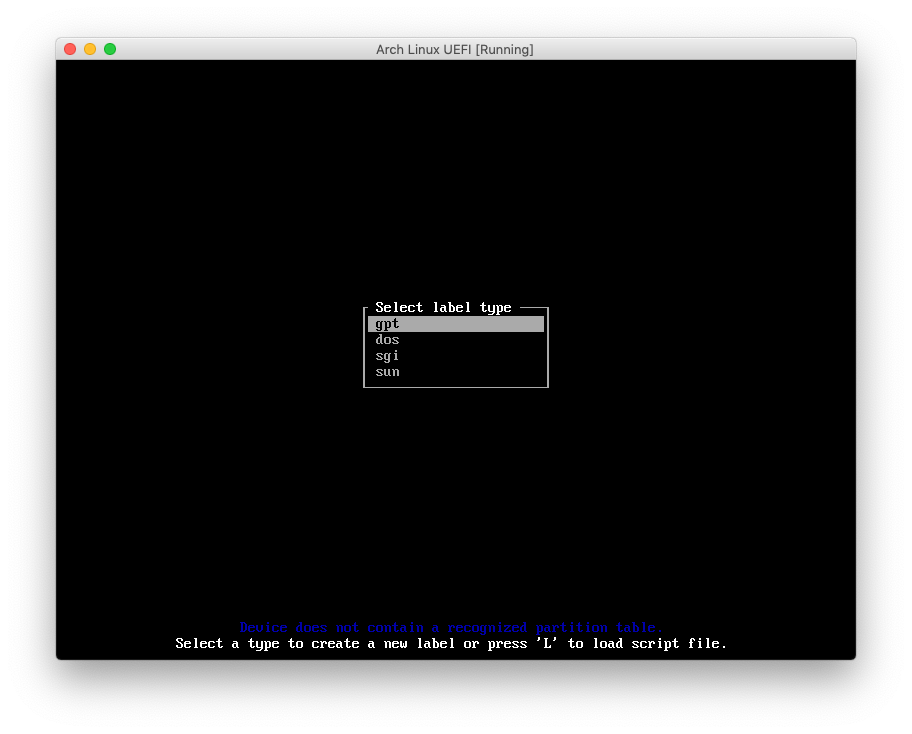

  > _**Legacy** or **BIOS** mode would use **dos**, but for **UEFI** we need to select **gpt**_

  <br>

* With `gpt` selected, hit the `enter` key:

  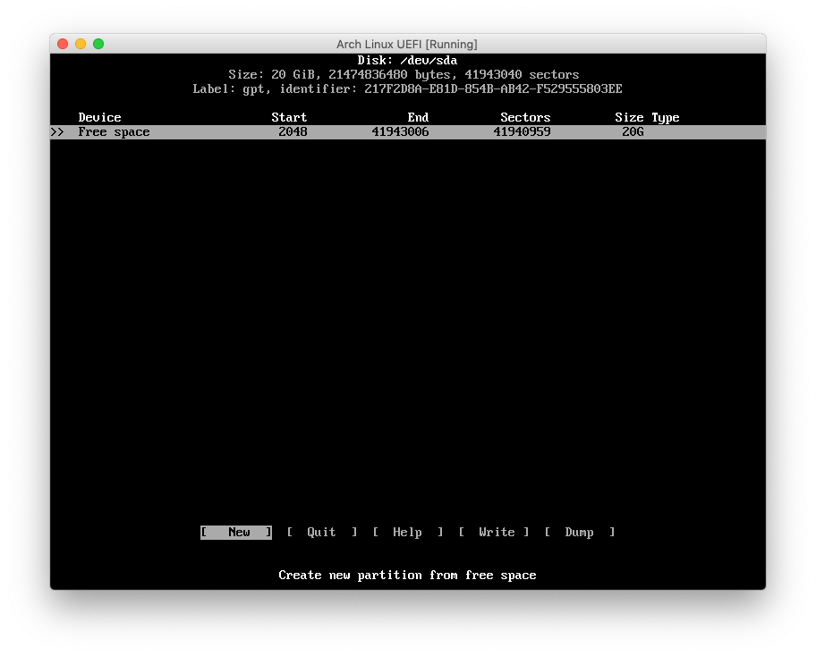

* Let's create our **UEFI** partition first:

  * From the total available space (20G at this point), hit the `enter` key to create a new partition and set the size of it to **512M**

    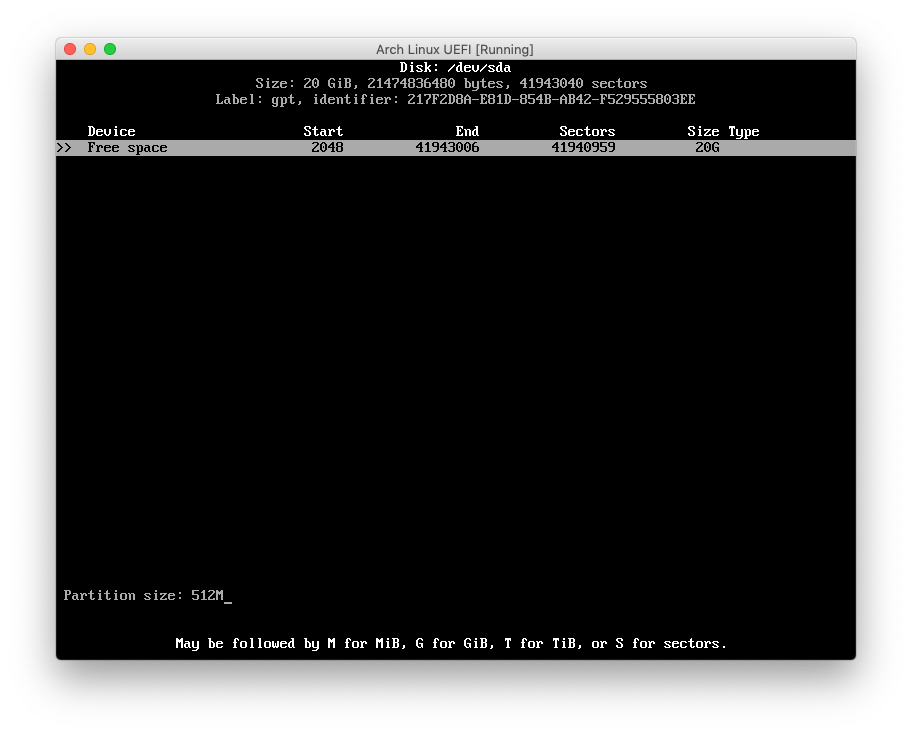

    <br>
  
  * Hit the `enter` key again and you'll see how the new partition is created (with the previously set 512M):

    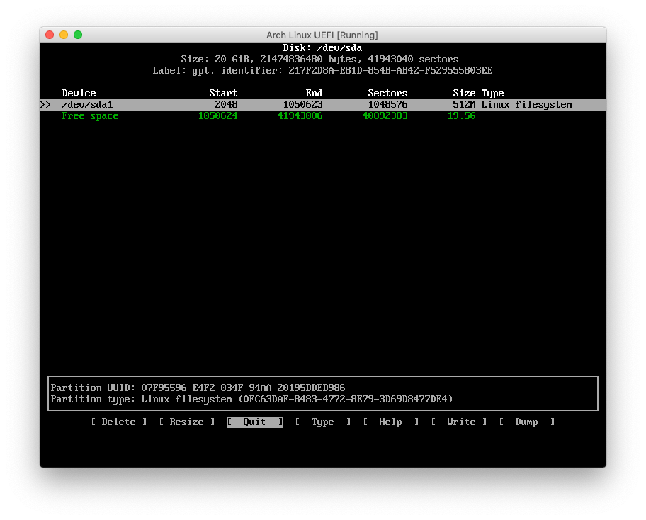

    <br>

* Now let's jump into our **SWAP** partition:

  * Move down (with the `down arrow`) to select **Free space** again, make sure that the **[ New ]** option is selected at the bottom and hit `enter` again. This time, for our SWAP partition, **we'll allocate 1G of space** (_in a real machine, you might want to give it up some more extra space, depending of your needs_):

    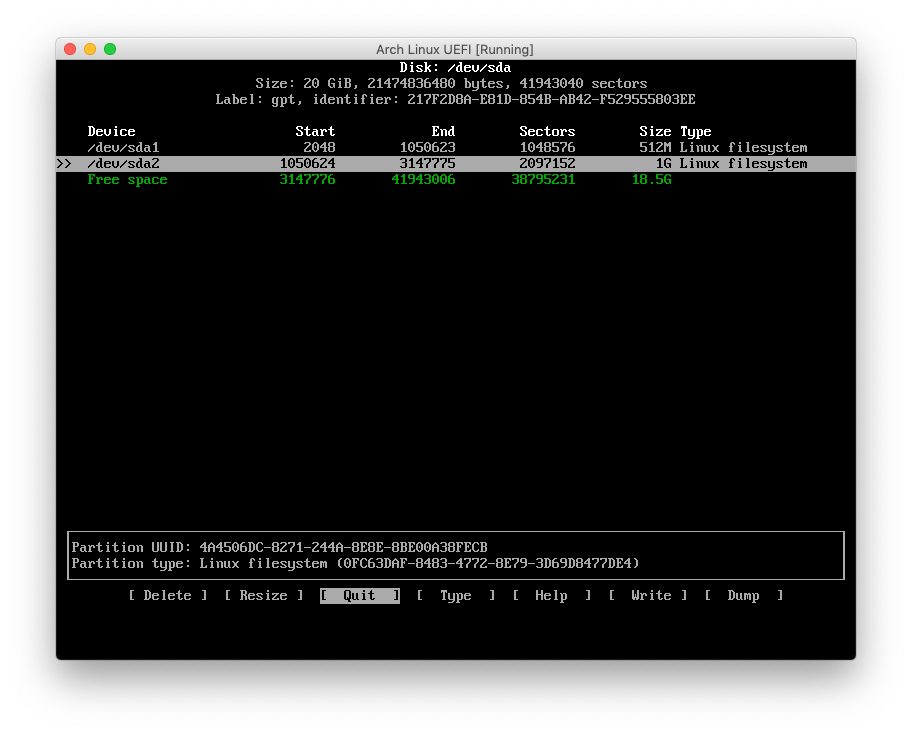

    <br>

  * With the recently created partition still selected, move to the right (with the `right arrow`) to **[ Type ]**, hit `enter` and select **Linux swap**:

    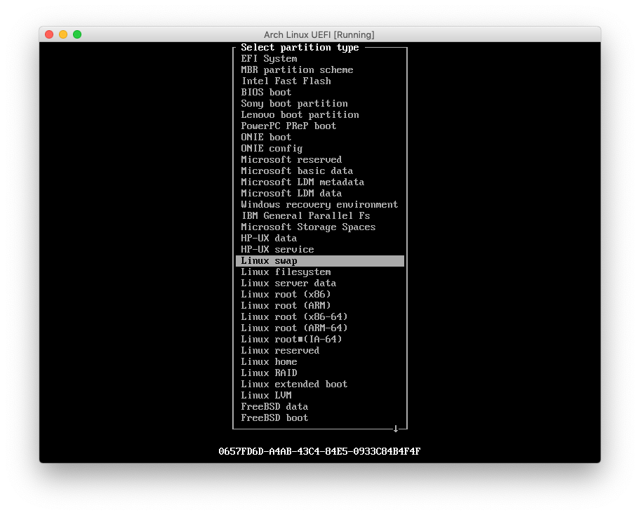

    <br>

  * Hit `enter` again and we'll return to the program's main screen and we should be able to see the two partitions we have just created (512M for our UEFI and 1G for our SWAP):

    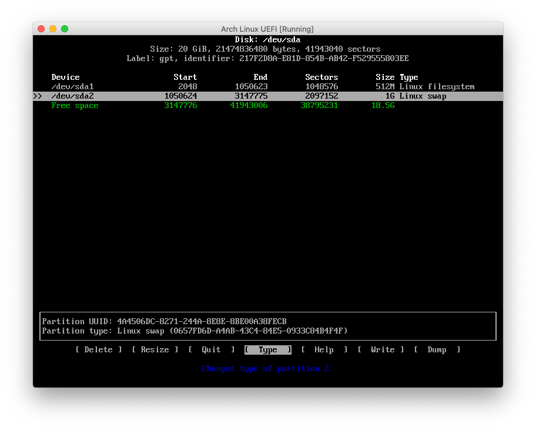

    <br>

* Once done, the only thing left is to create our **Main Partition** (where our filesystem will live):
  
  * Move down again to select **Free space**, make sure the **[ New ]** option is selected at the bottom, hit `enter`, and allocate the remaining available space for the current partition:

    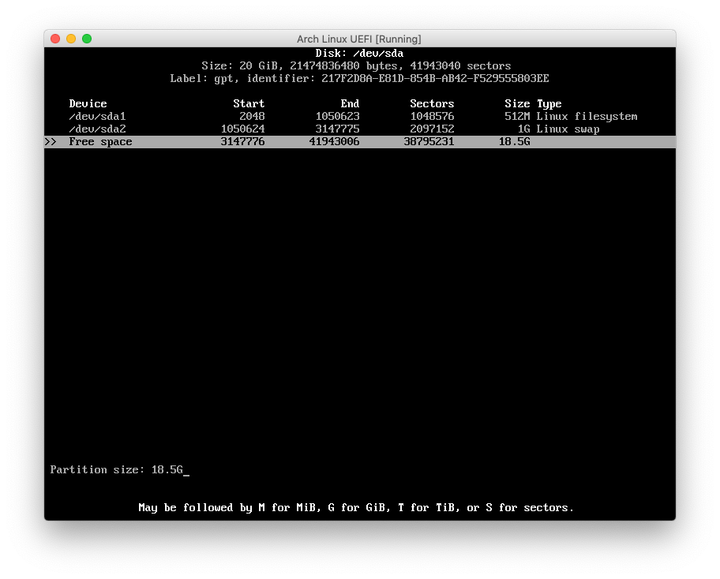

    <br>

  * Hit `enter` again (to actually set the available space for the new partition) and that's it!

    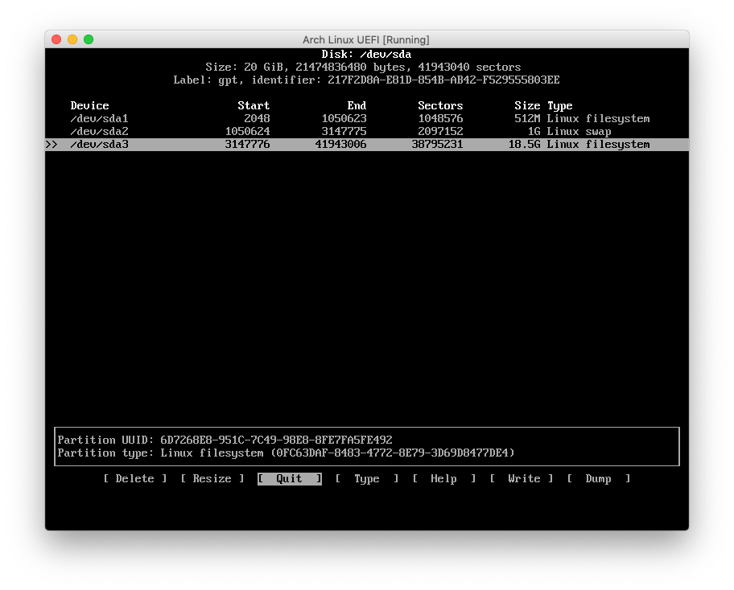

    <br>

  * We now have our **UEFI**, **SWAP** and **MAIN** partitions created... but they are not written into the actual disk yet! 🤯

* To write what we have configured into the actual disk:

  * We need to move right (with the `right arrow`) to the **[ Write ]** option 
  * Once there, hit `enter`
  * Type `yes` (the entire word)
  * And hit `enter` again. You'll see a message confirming the alteration of the partition table:

    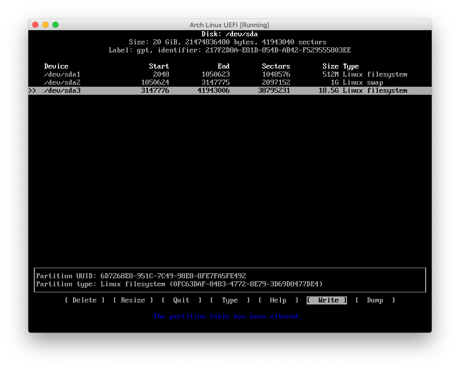

    <br>

  * Move left to **[ QUIT ]** and hit `enter` again. This time we're done with the partitions!
  * _But we still need to properly format them..._

<br>

### Formatting the Partitions

Before jumping into the actual formatting of our partitions, let's double check that the partition table looks as expected.

Run `fdisk -l` once more and check the output:


From the above, we can say that

* `/dev/sda1` is our **UEFI** partition with 512M of space
* `/dev/sda2` is our **SWAP** partition with 1G of space
* `/dev/sda3` is our **MAIN** partition with 18.5G of space

<br>

To properly format them, let's run some other commands:

* Run the following command to properly format the **UEFI** partition (`/dev/sda1` with 512M of space)
  ```bash
  $ mkfs.fat -F32 /dev/sda1
  ```

* Now run the following command to properly format the **HOME** partition (`/dev/sda3` with 18.5G of space)
  ```bash
  $ mkfs.fat -F32 /dev/sda3
  ```

  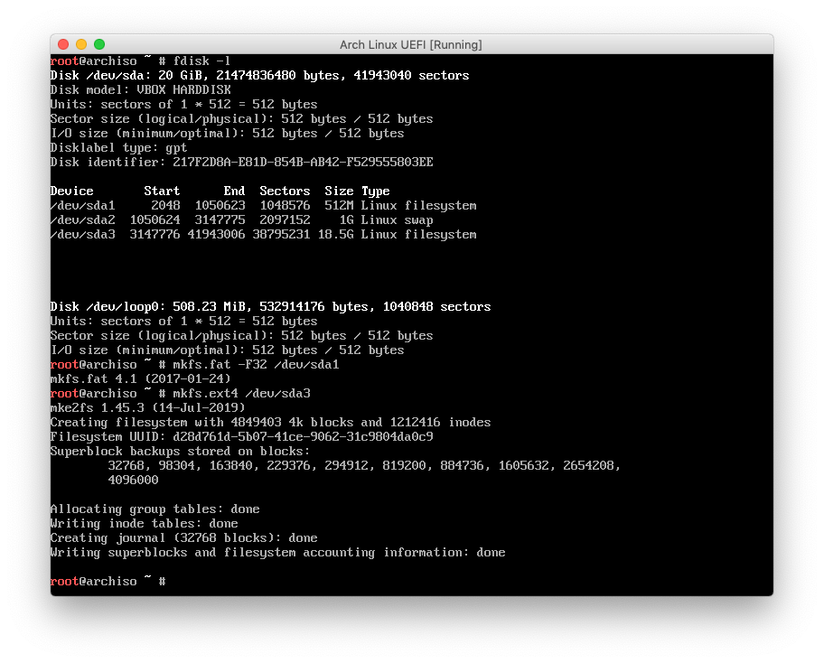

  > _**Make sure that you don't mess with `/dev/sda2` just yet**_

  <br>

* And last but not least, run the following commands to properly format the **SWAP** partition (`/dev/sda2` with 1G of space)
  ```bash
  $ mkswap /dev/sda2
  $ swapon /dev/sda2
  ```

  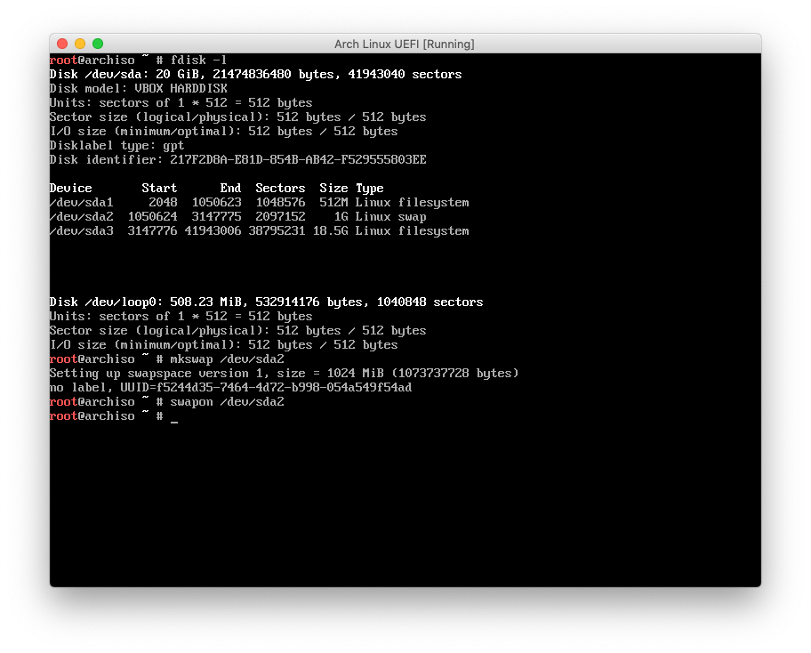

<br>

Well done! We have properly partitioned and formatted our disk...

<br>

### Mounting the file system

* Run the following command to mount the file system on the root partition to `/mnt`:
  ```bash
  $ mount /dev/sda3 /mnt
  ```

* And then run `lsblk` to make sure it was properly mounted:

  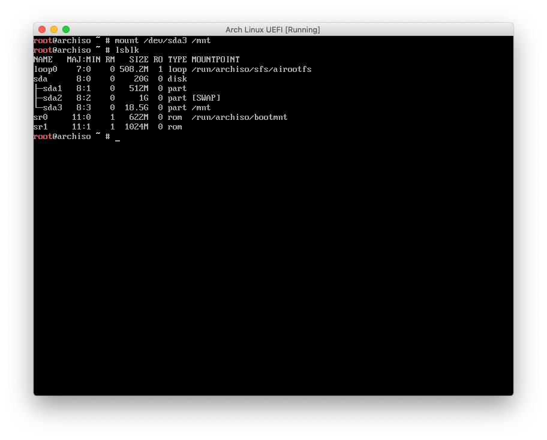

  <br>

* We'll come back later to setup our `efi` partition as required. For now, let's move on to the next steps.

<br>

## Installation Process

So far, we have the required initial setup to start installing some packaged and make our Arch Linux distribution alive!

<br>

### Optimizing our mirrors

This step is optional, but I've found that it might be really useful to speed-up the installation process of some packages.

As previously mentioned, there's a huge list of mirrors all around the globe from where we can install the packages we want, but it is worth to mention that that further they are from our physical location, the more they will take to provide us with the files we need (_we don't want to download a package that is hosted on some server in Russia if we are in Peru, right?_ 🤨).

<br>

For this to be possible, we need to edit `/etc/pacman.d/mirrorlist`. Quite easy, right? But... do you know if there is any available text editor already installed on the system? 🥺

Fortunately, we do have our friend `nano` already installed and ready to be used for these kind of purposes! 💪🏻

Run the following command (using your preferred text editor) to get into the mirrors list and optimize it a little bit:
```bash
$ nano /etc/pacman.d/mirrorlist
```

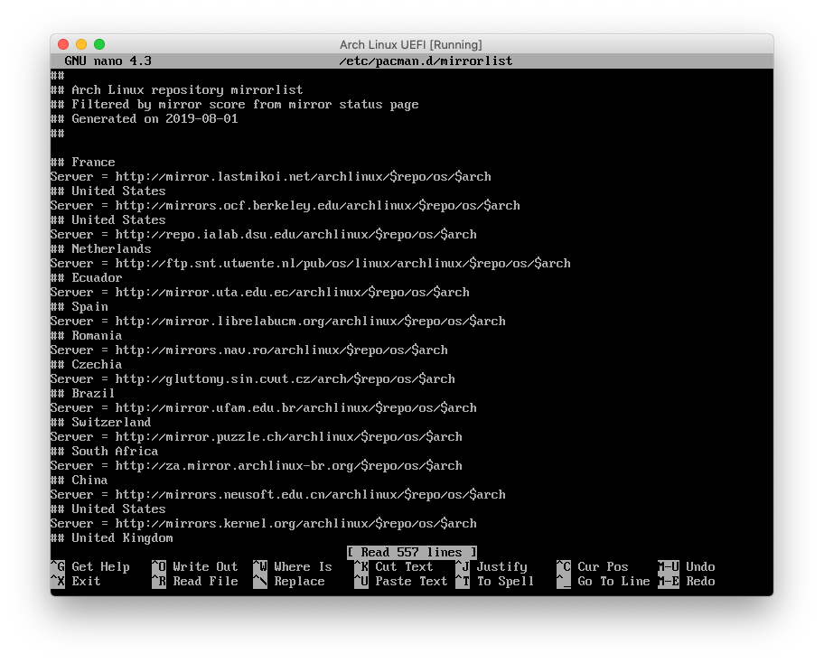

Don't freak out... just yet. What we need to do is _"simply find the mirrors that are far away from our physical location and remove them from the list"_

I won't get into much details about this, but the idea is to keep at least 6 or 7 mirrors (the closest to us) and remove everything else.

<br>

> _Don't forget `Ctrl + K` to **delete lines** (you're going to need it), `Ctrl + O` to **save** and `Ctrl + X` to **exit**_

<br>

### Install the base packages

* Run the following command to install the `base` and `base-devel` packages from Arch Linux:
  ```bash
  $ pacstrap -i /mnt base base-devel
  ```

* Once ran, select the default prompted options (by hitting the `enter` key) and, at the end, hit the `y` key (to confirm the installation):

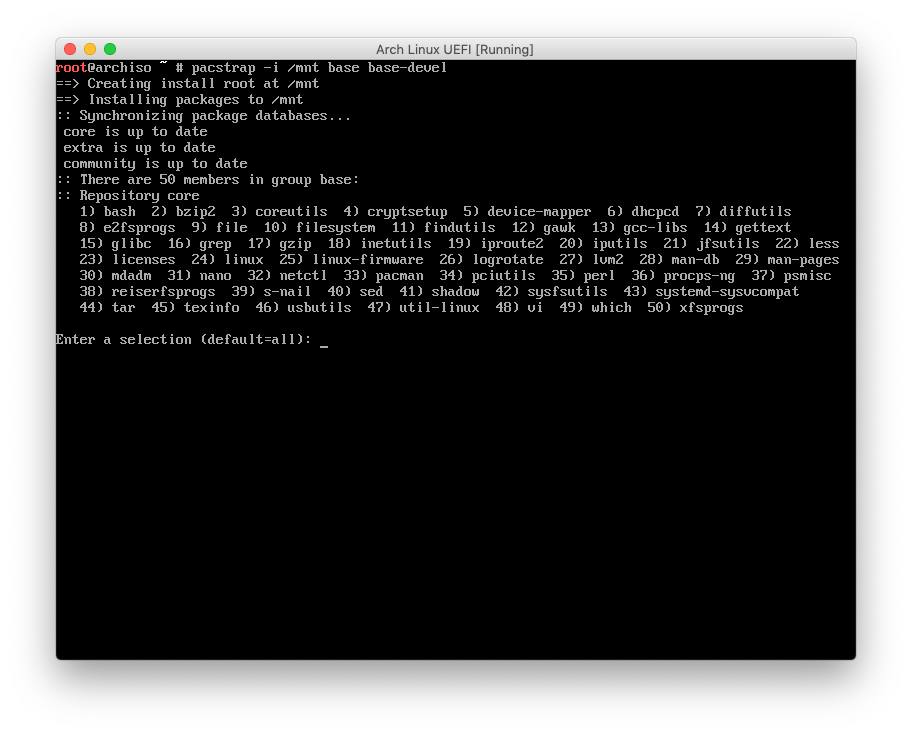


<br>

That's going to take a while, so make yourself comfortable and, if you want, take a look at the packages being installed 🤓

<br>

## Configuring the system

<br>

### Generate the File System Table

  * Generate an `fstab` file by running:

  ```bash
  $ genfstab -U /mnt >> /mnt/etc/fstab
  ```

<br>

### CHRooting into the new system

* To login as root into the new system, run:

  ```bash
  $ arch-chroot /mnt
  ```

  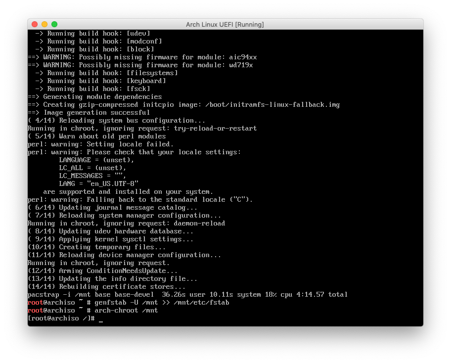

  > _Note how the prompt has changed... we're no longer root on the Live Environment but **root on our brand new system!**_

<br>

* And, as we are already on our system, we can run our dear pal `ls` to list the files on the system:

  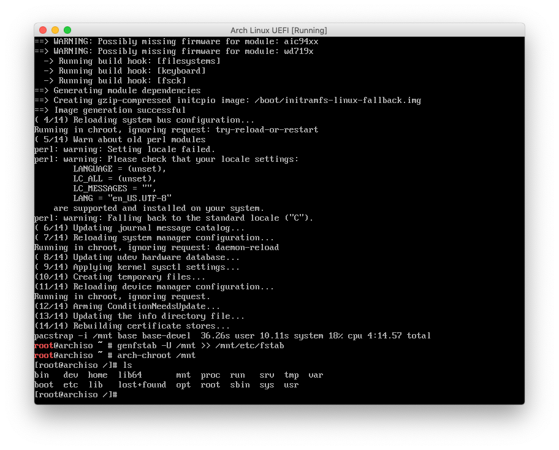

<br>

### Setting the Time Zone

* Run the following command, taking in count your might need to use different Zones

  ```bash
  $ ln -sf /usr/share/zoneinfo/America/Lima /etc/localtime
  ```

  * Where `America` is the Zone I'm selecting
  * And `Lima` is the City (inside the Zone) I'm also selecting

  

  > _You can press `tab` to see the list of available Zones and then, once you've identified yours, you can `tab` again to see the list of available cities_

  <br>

* The run the following command to generate `/etc/adjtime`:
  ```bash
  $ hwclock --systohc
  ```

<br>

###  Localization

* Let's first select our corresponding `locale` and `charset` _(in my case, I'll maintain the system in English -as my Keyboard Layout)_ by running the following command:
  ```bash
  $ nano /etc/locale.gen
  ```

<br>

* Search for your desired combination and uncomment the corresponding line _(In my case `en_US.UTF-8 UTF-8`)_:

  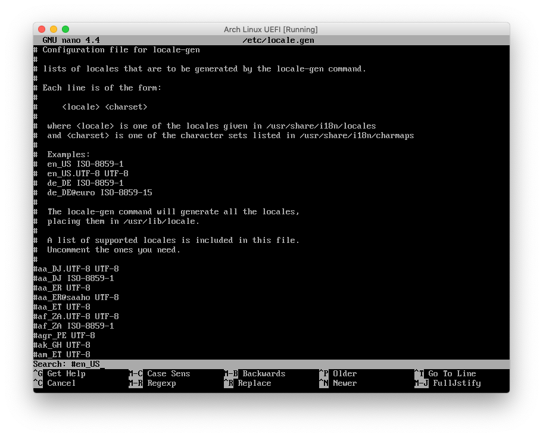

  > _You can use `Ctrl + W` in `nano` to **search text**. Once found, just uncomment the appropriate line and then hit `Ctrl + O` to **save** and then `Ctrl + X` to **exit**_

  <br>

* Then just run the following command to actually generate the localization files for the system:
  ```bash
  $ locale-gen
  ```

  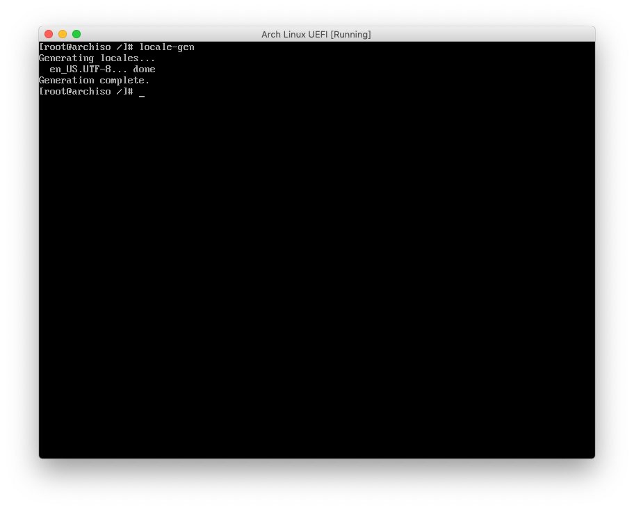

  <br>

* Once done, we need to create the `/etc/locale.conf` file. To do so, run:
  ```bash
  $ nano /etc/locale.conf
  ```

  <br>

* And set the following content to the recently created file: `LANG=en_US.UTF-8` _(again, this will depend on how you're configuring your installation)_

  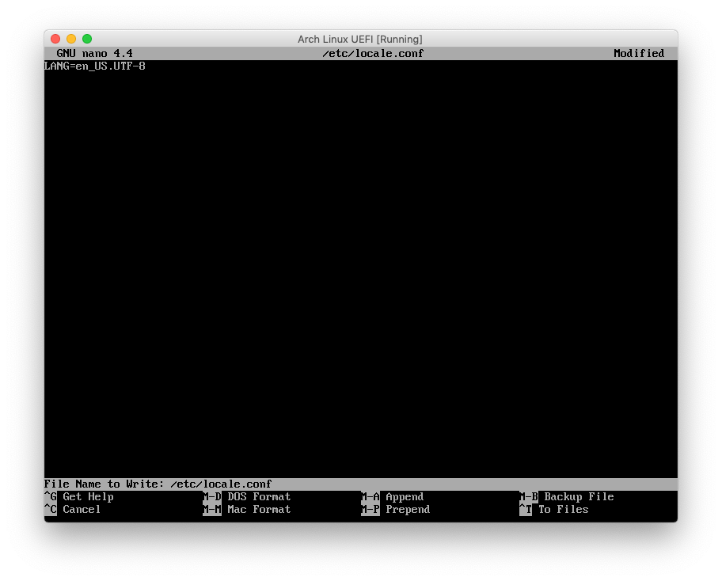

  > _Don't forget to save the file and then exit the editor_

  <br>

### Network Configuration

* First we need to set our **hostname**, the name that our PC will use:
  ```bash
  $ echo archVM > /etc/hostname
  ```

  > _This will create a new text file called `/etc/hostname` with `archVM` (the hostname I've decided to go to with -yours might be different-) as the sole content of the file_

  <br>

* And then we need to add the matching entries into our `hosts` file. Edit the file, by running the following command and changing its content:
  ```bash
  $ nano /etc/hosts
  ```

  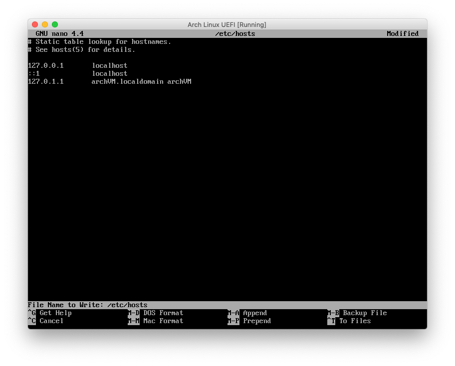

  > _You might need to change `archVM` for the hostname you set on the step above. Don't forget to save and then exit!_

  <br>

### Enable the Network

* We need to install a package in order to be able to properly enable our system's network. Run the following command and then hit `y`or `Y` to proceed with the installation:
  ```bash
  $ pacman -S networkmanager
  ```

  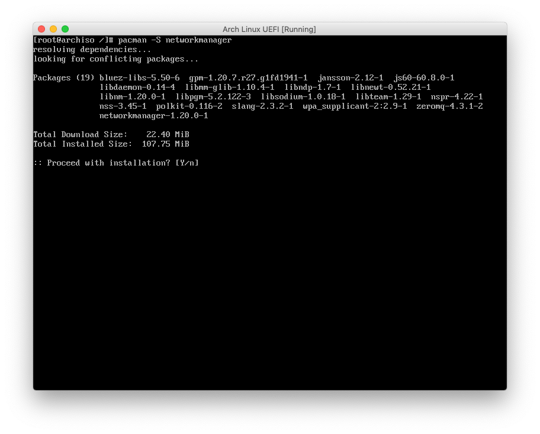

  <br>

* Once installed, enable it:
  ```bash
  $ systemctl enable NetworkManager
  ```

  > _Please, note the **capital N** and **capital M** on the name of the service we're trying to enable_

  <br>

* The above will create some symbolic links required for the Network Manager to boot up properly along with your system.

<br>

* Then we need to enable another service to make sure every time the system boots up, our network configuration is up & running as well _(remember when I mentioned that the official installation guide is not that much extensive? Well, this is one of those things that it don't explicitly mentions)_ 🙄
  ```bash
  $ systemctl enable dhcpcd
  ```

<br>

### Root Password

* We've reached that point in which we're finally going to create a password for our root user. _Wait... what!? For the root user?_ 🤬. Yes, just only a few more commands to get everything properly set and we'll get into the real deal

* Run `passwd` and type the password you'll want the **root user** to have (it will ask you to enter it twice)

  > _`passwd` is one of those commands that we'll need every time we're setting up a new Linux Installation, so I strongly recommend you to give the man page a look and get it to know a little bit more in detail_

* In this case, and as we're not passing any parameters into the command, it will create a new password for the current user _(which is... **root** yeah!_ 🤴🏻).

<br>

### Configuring Users and Groups

Besides the root user, we might need another user (our own) to be able to log into our system without the need of being root all the time (which is not 100% recommended, but it will depended on how and with what purpose you're configuring this installation).

* Run the following command to add a new user to the system:
  ```bash
  $ useradd -m charlie
  ```

  > _Where `charlie` is the user I'm currently adding. You might one to add a different one_

  <br>

* Now let's create a password for our brand new user _(remember how to create a password?)_ 🤔
  ```bash
  $ passwd charlie
  ```

  > _Add the desired password once, then again, and we're all set_

  <br>

* Now let's add `charlie` to the required Groups and grant it with sudo privileges

  * `sudo` does not come included on the basic Arch Linux installation, so we need to install it _(hit `y` once prompted for confirmation)_:
    ```bash
    $ pacman -S sudo
    ```

    <br>

  * Add the user to the **wheel** group, which is the Arch Linux default group for users with root privileges _(other distros might have different group names for this same purpose)_:
    ```bash
    $ usermod -aG wheel,audio,video,optical,storage charlie
    ```

    > _To double check that the above command did its job, just run `groups charlie` and confirm that the groups in which we previously added our user are listed on the output_

    <br>

  * Add the user to the **sudoers** (so it can run commands that require root privileges without having to actually become root):
    ```bash
    $ visudo
    ```

    > _You might notice that the above command returned an error... Whaaat?_ 😤. _Well, we're installing one of the minimalest Linux Distributions out there, right? We need to install it first to be able to use it_

    <br>

    > _If you want to miss some of the fun, you can just run `EDIATOR=nano visudo` and edit the file using `nano`_ 🤷🏻‍♂️

    <br>

    * Install `vim` by running the following command:
      ```bash
      $ pacman -S vim
      ```
    
      <br>
  
  * Then run the `visudo` command again to open the `/etc/sudoers.tmp` file

    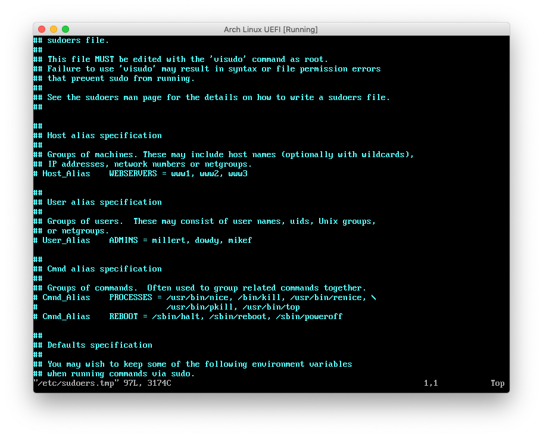

    <br>
  
    * Now try to navigate through the file... _but do not use your arrow keys_ 😏
    * This is a great opportunity to get immersed (just a little bit, though) into the **Vim World**
    * Use `h` to **navigate left**
    * Use `l` to **navigate right**
    * Use `j` to **navigate up**
    * Use `k` to **navigate down**
    * The Vim Keys! 🤘🏻

    <br>

    * Navigate down until you find the line that says _"Uncomment to allow members of group wheel to execute any command"_. Make sure your prompt is one more line down of the comment (just where `# wheel ALL=(ALL) ALL` is) and hit `x` to delete the current character... 🤯 _yes, welcome to Vim_

      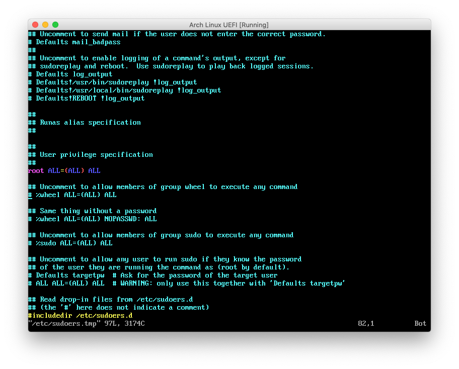

      <br>

    * Once you have uncommented the required line, hit `:`, type `wq` and then hit `enter`... _Yes, my friend. Write the file and then Quit the program_ 🔥

      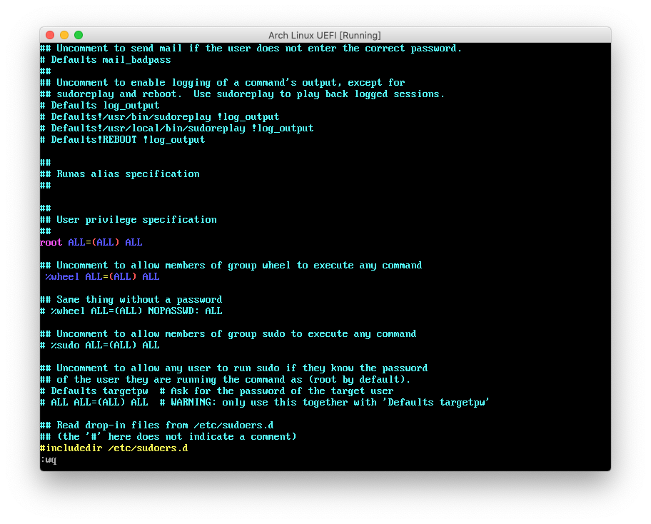

      <br>

### The Boot Loader

Before we can reboot our system for the very first time and be able to login with our brand new User, we need to make sure that we have a boot loader properly installed and configured (otherwise, things might get weird the next time we try to boot up our system).

This is the most crucial step for the **UEFI Installation Mode** guide we're following (as it differs a little bit ~~maybe more~~ from what it is required for a **Legacy / BIOS** installation).

* First we need to install the required packages (confirm the installation by hitting `y` when prompted):
  ```bash
  $ pacman -S grub efibootmgr
  ```

  <br>

* Create the `efi` folder (which needs to be inside `/boot`):
  ```bash
  $ mkdir /boot/efi
  ```
  
  <br>

* Run `lsblk` to remember which is the identifier for our **UEFI** partition

  

  > _If you remember (because I couldn't), our UEFI partition was the one with 512M of available space_

  <br>

* Once we know ~~remember~~ which is our **UEFI** partition and how it is identified, let's run the following command:
  ```bash
  $ mount /dev/sda1 /boot/efi
  ```

  > _Where `/dev/sda1` is our partition and `/boot/efi` is the location in which we're going to mount it_
  
  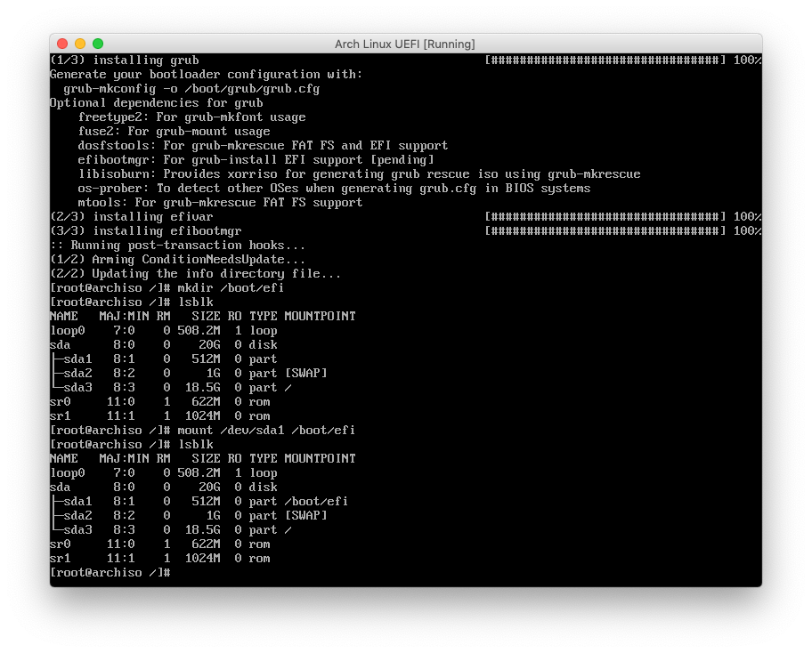

  > _If you want to double check, feel free to re-run `lsblk` and confirm that everything looks good_

  <br>

* Run the following command to install the **grub** under **UEFI** conditions (this command is very different from the one to install the grub on other modes, so please be extra careful with the parameters we're going to pass):
  ```bash
  $ grub-install --target=x86_64-efi --bootloader-id=GRUB --efi-directory=/boot/efi
  ```

  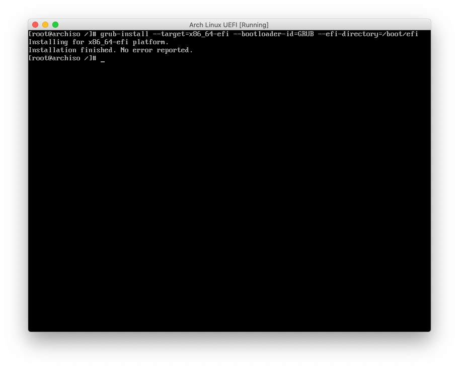

  <br>

* Once finished (without any errors), we need to run the following command in order to create the config file for the previously installed boot loader:
  ```bash
  $ grub-mkconfig -o /boot/grub/grub.cfg
  ```

  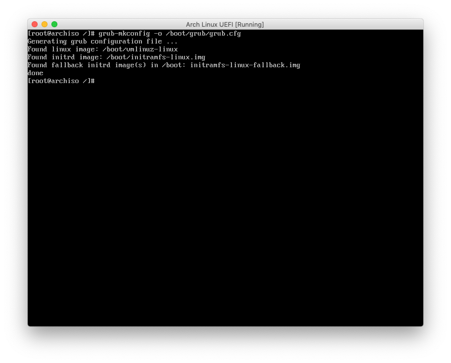

  <br>

* Up to this point, if you are already installing the distro on your real hardware, you might be able to reboot your system and get it up & running without any issues; unfortunately, UEFI gives some additional troubles when simulating a real installation on a VM, so we'll need to run a few more commands to make sure our system (virtualized, in this case, always boots).

* Create a new directory to be able to have a _backup_ boot loader in case the original fails at startup:
  ```bash
  $ mkdir /boot/efi/EFI/BOOT
  ```

* And then copy the original file from the previously installed grub into our recently created backup/fallback folder:
  ```bash
  $ cp /boot/efi/EFI/GRUB/grubx64.efi /boot/efi/EFI/BOOT/BOOTX64.EFI
  ```

  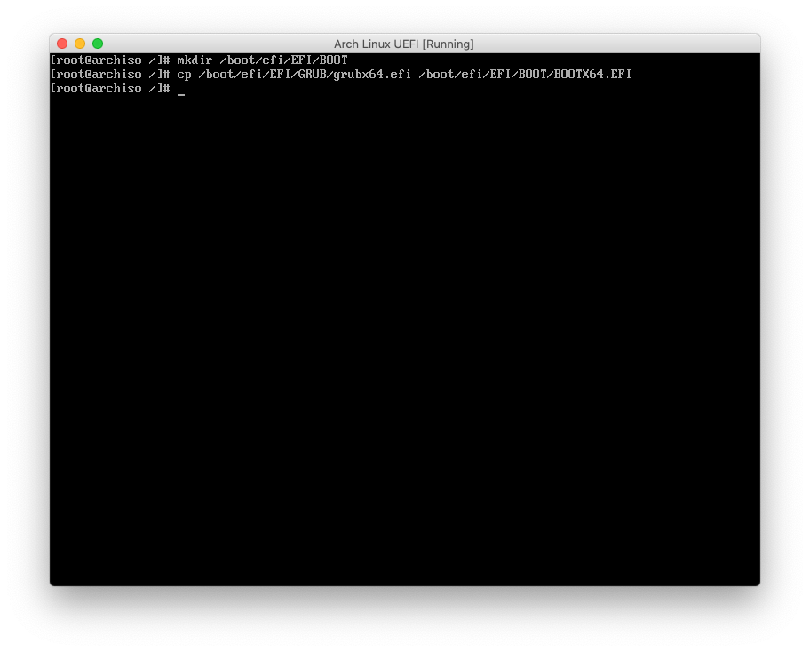

  > _Make sure you are using the same Capital Letters and be careful with the renaming of the `grubx64.efi` file (which needs to be copied as `BOOTX64.EFI`, all in caps)_

  <br>

* To be even safer, let's create a startup script for UEFI:
  ```bash
  $ nano /boot/efi/startup.nsh
  ```
  
  <br>

* Inside the file, let's add the following contents:
  ```
  bcf boot add 1 fs0:\EFI\GRUB\grubx64.efi "My GRUB boot loader"
  exit
  ```

  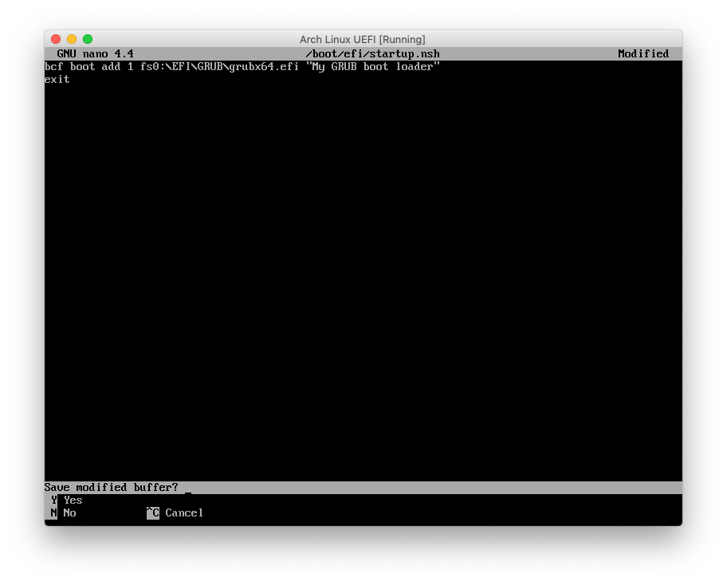

  > _**Be careful with the Capital Letters and also with the back slashes `\` used on the file contents**_

  <br>

* Run `exit` to sign out from the system's root user account

* Run `umount -R /mnt` to recursively unmount all the previously mounted partitions

* And run `reboot`... _fingers crossed _ 🤞🏻

<br>

Once done, we should have our **UEFI** Arch Linux installation up, booting & running! 👏🏻

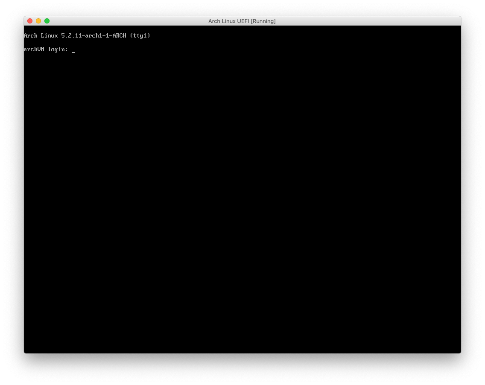

<br>

> _Don't forget to shutdown your VM, go to it's settings and remove the virtual ISO we added at the beginning of the guide as we won't need it any more_

<br>

### Installing some additional basic packages

From now on, everything you decide to install on your system will depend on what you need and what you want. In my case, I'll try to install a couple of useful packages that are for general use for the most part:

* To do so, login as your user (we don't need to use the root account anymore) and run:

```bash
$ sudo pacman -S pulseaudio pulseaudio-alsa xorg xorg-xinit xorg-server lightdm lightdm-gtk-greeter virtualbox-guest-utils
```

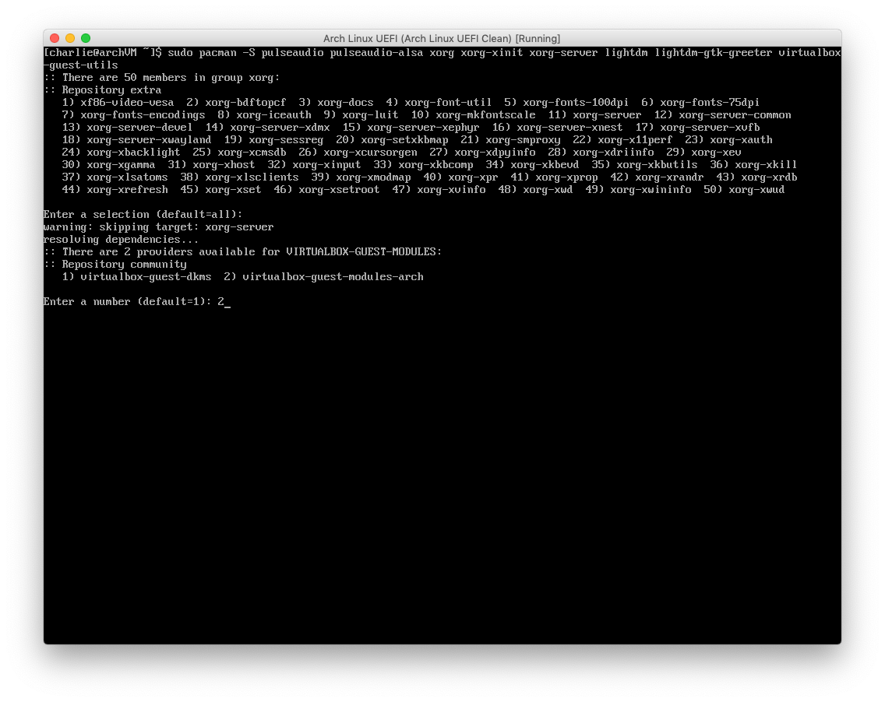

> _`xorg` will ask confirmation about which components to install (nearly 50), just hit `enter` to install them all_

> _In the case of `virtualbox-guest-utils`, make sure to type `2` and then hit `enter` to install the desired `virtual-box-guest-modules-arch` package_

<br>

